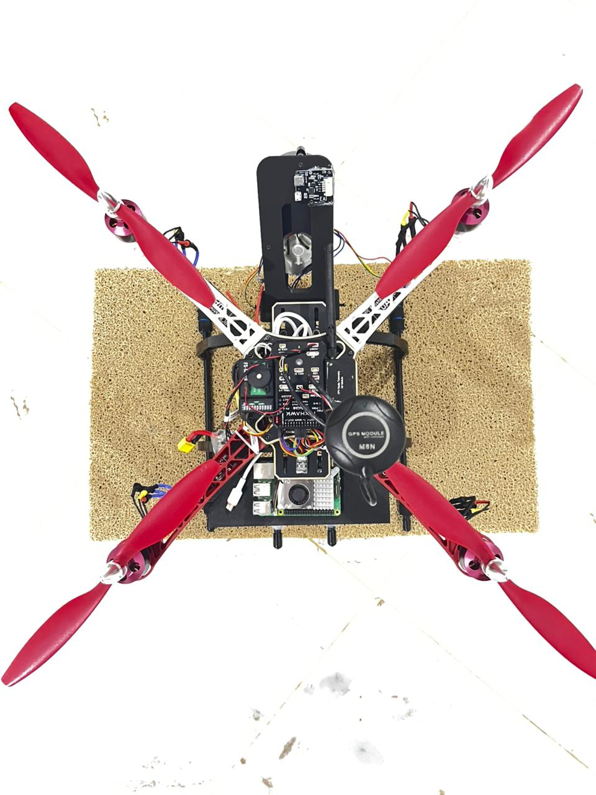
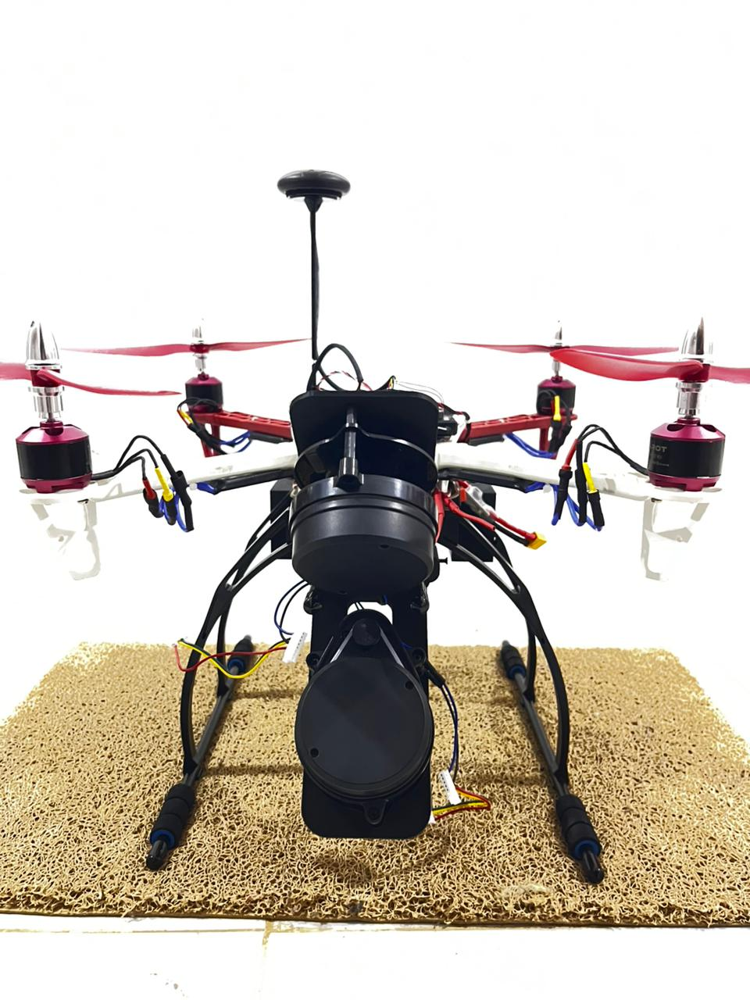
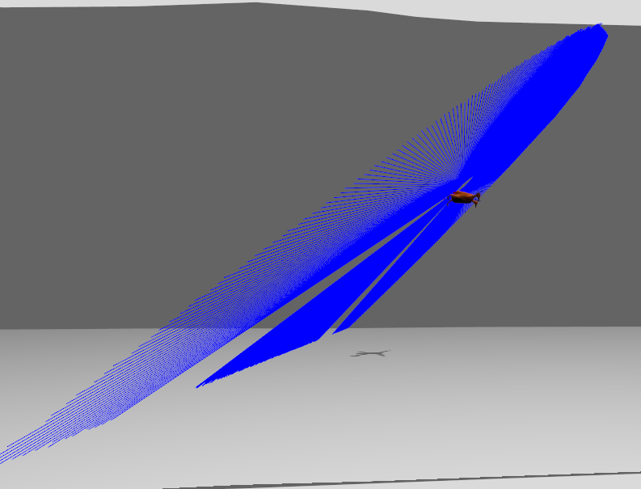
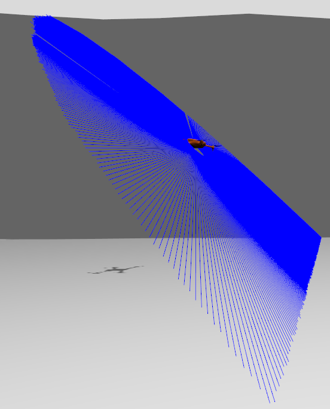
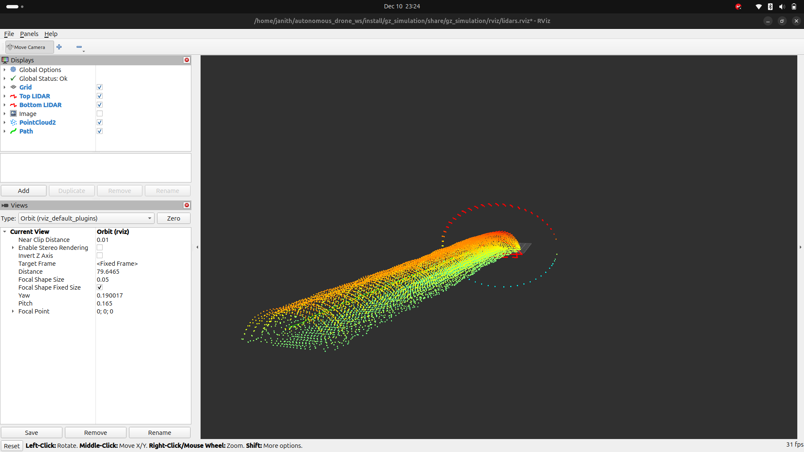

# **Autonomous Drone for Cave Mapping**

**Autonomous Drone for cave mapping — A drone capable of navigating caves or tunnels automatically to map its inside environment and map them in 3D.**

This project focuses on building an autonomous aerial platform designed to explore and reconstruct underground environments such as caves, mines, and tunnels. The drone operates in fully GPS-denied conditions and generates detailed 3D maps using LiDAR, vision, and SLAM-based navigation.

### Our Drone in Action

_Top view of the drone showing frame layout and component placement_

_Front view displaying LiDAR configuration_

_Close-up of the LiDAR sensor mounting_

### Simulated Tunnel Mapping

_Top-down LiDAR scan visualization in simulated tunnel environment_

_Bottom LiDAR point cloud capturing floor topology_

_Stacked LiDAR point clouds representing the tunnel structure_
